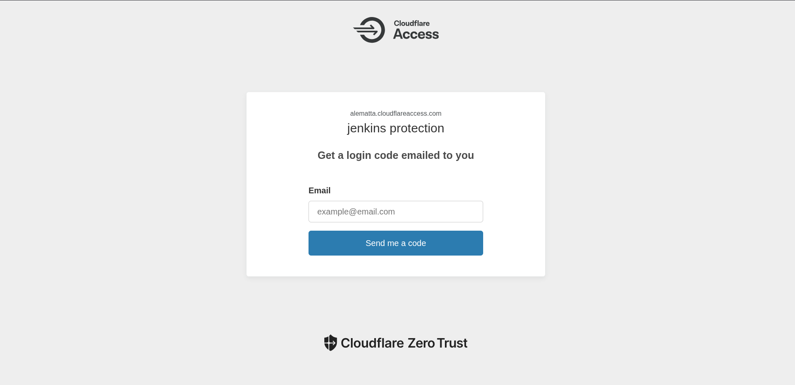
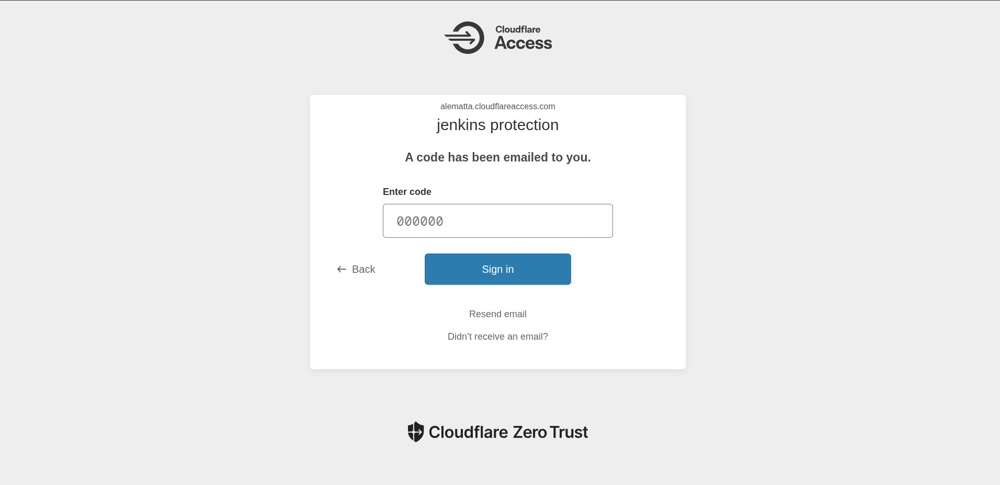

# Migrazione e Espansione Pipeline CI/CD: Da GitHub Actions a Jenkins
# Indice

- [Cosa è Jenkins](#cosa-è-jenkins)
- [A cosa serve](#a-cosa-serve)
- [Jenkins controller (master) e agenti (worker)](#jenkins-controller-master-e-agenti-worker)
- [Dockerfile di Jenkins: Permessi, Gruppi e Sicurezza Utente](#dockerfile-di-jenkins-permessi-gruppi-e-sicurezza-utente)
- [Differenza tra Docker-in-Docker e Docker-outside-of-Docker](#differenza-tra-docker-in-docker-e-docker-outside-of-docker)
- [Roadmap futura](#roadmap-futura)
- [Note sull'integrazione Docker/Jenkins in container](#note-sullintegrazione-dockerjenkins-in-container)
- [Separazione dei Makefile: Applicazione vs Infrastruttura](#separazione-dei-makefile-applicazione-vs-infrastruttura)
- [Prima installazione di Jenkins: password e utente admin](#prima-installazione-di-jenkins-password-e-utente-admin)
- [Accesso Sicuro tramite Cloudflare Tunnel](#accesso-sicuro-tramite-cloudflare-tunnel)
- [Pipeline Jenkins: pipeline semplice](pipeline-example.md)
- [Pipeline jenkins: pipeline scm + collegamento ssh git e trigger su branch main](pipeline-scm.md)
- [Pipeline jenkins: pipeline scm con push su registro ghcr](pipeline-push-GHCR.md)

Questo progetto nasce con l'obiettivo di migrare e ampliare la pipeline CI/CD precedentemente gestita tramite GitHub Actions, portandola su Jenkins. L'infrastruttura è stata pensata per testare e implementare pipeline sempre più complesse, partendo da semplici test tramite l'interfaccia web di Jenkins, fino ad arrivare alla creazione di pipeline avanzate tramite Jenkinsfile. La pipeline finale prevede le seguenti fasi:
- Checkout del codice
- Build dell'applicazione
- Test automatici
- Push delle immagini su un registro Docker
- Deploy tramite pull delle immagini nel docker-compose

## Cosa è jenkins 
Jenkins è un software open source per l'automazione di processi di integrazione e distribuzione continua (CI/CD). Permette di gestire pipeline di build, test e deploy in modo automatizzato, integrandosi con numerosi strumenti di sviluppo, versionamento e infrastruttura. Grazie alla sua architettura a plugin, Jenkins è altamente personalizzabile e supporta una vasta gamma di linguaggi, ambienti e workflow DevOps.

## A cosa serve 
Jenkins serve principalmente per automatizzare il ciclo di vita del software: dal checkout del codice sorgente, alla compilazione, esecuzione dei test, creazione di artefatti, fino al deploy su ambienti di produzione o test. Consente di ridurre errori manuali, velocizzare i rilasci, garantire qualità e tracciabilità delle modifiche, integrandosi facilmente con repository Git, Docker, cloud, strumenti di notifica e molto altro.


## Jenkins controller (master) e agenti (worker)
In Jenkins, l'architettura classica prevede un **controller** (precedentemente chiamato "master") e uno o più **agenti** (detti anche "worker", in passato "slave").

- Il **controller** gestisce l'orchestrazione delle pipeline, la UI, la configurazione dei job e la distribuzione dei task agli agenti( nel mio caso puo essere il mio pc o la mia vps hetzner)
- Gli **agenti** sono macchine (VM, server, container) che eseguono fisicamente i job e le build. Possono essere configurati per eseguire job specifici, avere tool diversi installati, e scalare in base alle necessità.

La terminologia moderna preferisce "controller" e "agent" (o "worker") invece di "master/slave" per motivi di inclusività. In pratica, il controller decide dove e come eseguire i job, mentre gli agenti sono gli esecutori reali delle pipeline.

## Dockerfile di Jenkins: Permessi, Gruppi e Sicurezza Utente

Per poter utilizzare Docker all'interno del container Jenkins, è stato necessario installare Docker seguendo la procedura ufficiale di installazione (come da documentazione Docker). Questo garantisce che il demone Docker sia disponibile e funzionante nel container, permettendo a Jenkins di eseguire build e gestire i container direttamente dai job. Solo dopo questa installazione è possibile scegliere tra le modalità DOoD e DinD per l'integrazione tra Jenkins e Docker.

Nel Dockerfile di Jenkins è stato poi necessario modificare i permessi del gruppo Docker (GID) e aggiungere l'utente Jenkins al gruppo Docker. Questo passaggio è fondamentale per permettere a Jenkins di utilizzare Docker senza problemi di permessi, ad esempio per eseguire build e gestire container direttamente dal job.

Per garantire la sicurezza, dopo aver installato tutti i pacchetti necessari e configurato Docker, il container viene eseguito con l'utente `jenkins` (non root). Questo segue il principio del minimo privilegio: Jenkins può accedere a Docker, ma non ha permessi amministrativi sul sistema, riducendo i rischi in caso di compromissione del servizio.

Se si prova ad accedere al container Jenkins per installare manualmente nuovi pacchetti, l'operazione non funziona perché l'utente di default è `jenkins` e non ha privilegi amministrativi. In questi casi, per operazioni di manutenzione straordinaria, è necessario accedere come root:

[Dockerfile custom di Jenkins](https://github.com/almat101/jenkins-migration-secure-ecommerce/blob/main/jenkins/Dockerfile)

```sh
docker exec -u 0 -it jenkins bash
```

## Differenza tra Docker-in-Docker e Docker-outside-of-Docker
**Docker-outside-of-Docker (DOoD)** è il metodo che sto usando attualmente: Jenkins (in container) accede direttamente al demone Docker dell'host tramite il mounting del socket Docker (`/var/run/docker.sock`). Questo approccio è semplice e funziona bene per ambienti di test e home lab, ma non è raccomandato in produzione per motivi di sicurezza, perché il container Jenkins ottiene privilegi elevati sull'host.

**Docker-in-Docker (DinD)**, invece, prevede l'avvio di un container separato che esegue il demone Docker al suo interno. Jenkins comunica con questo demone tramite API (TCP + TLS), senza accedere direttamente al socket dell'host. DinD offre maggiore isolamento e sicurezza rispetto a DOoD, ma introduce complessità aggiuntiva e non è sempre necessario, soprattutto se si usano agenti esterni.

**Approccio attuale:**
Sto usando DOoD (Jenkins + Docker) per la pipeline su VPS, ideale per test e sviluppo.

## Differenza tra DOoD e DinD

- **DOoD (Docker-outside-of-Docker):** Jenkins accede direttamente al demone Docker dell’host tramite il mounting del socket Docker. È semplice ma meno sicuro, adatto solo a test/home lab.
- **DinD (Docker-in-Docker):** Jenkins comunica con un demone Docker separato, avviato in un container dedicato (spesso tramite API e TLS). Offre maggiore isolamento e sicurezza, consigliato per ambienti di produzione.

Attualmente uso DOoD per semplicità, ma in futuro migrerò verso agenti EC2 per maggiore sicurezza.

## Roadmap futura
Quando migrerò a una soluzione più sicura e scalabile, userò Jenkins come controller (senza Docker installato) e agenti EC2 esterni con Docker/Docker Compose installati. Gli agenti EC2 eseguiranno le fasi di build, test e deploy, eliminando la necessità di DOoD o DinD sul controller Jenkins.
Inizialmente la pipeline verrà creata e testata su questa VPS (ambiente di test/home lab) con Jenkins installato e il volume del socket Docker montato, sia tramite interfaccia web che Jenkinsfile.

Quando la pipeline sarà funzionante, il mounting del volume Docker verrà commentato o rimosso e la pipeline verrà migrata su agenti EC2 esterni, sfruttando anche eventuali plugin per la gestione automatica degli agenti. Questo approccio permette di partire in modo semplice e poi evolvere verso una soluzione più sicura e scalabile.

## Note sull'integrazione Docker/Jenkins in container
Per garantire la massima flessibilità e sicurezza, i test sono stati effettuati utilizzando un container custom di Jenkins su una VPS Hetzner. In questo container, oltre a Jenkins, è stato installato Docker seguendo la procedura ufficiale. Questo consente a Jenkins di controllare direttamente l'applicazione tramite Docker e Docker Compose.

La chiave di questa integrazione è il mounting del volume `/var/run/docker.sock` nel container Jenkins, che permette a Jenkins di interagire con il demone Docker della macchina host (VPS o PC locale). In questo modo, Jenkins può gestire i container e orchestrare le operazioni necessarie per la pipeline.

## Separazione dei Makefile: Applicazione vs Infrastruttura
È stata effettuata una separazione tra il Makefile classico, dedicato all'applicazione, e un Makefile specifico per l'infrastruttura. Quest'ultimo si occupa di avviare Jenkins e il tunnel Cloudflare.


## Prima installazione di Jenkins: password e utente admin
Alla prima installazione di Jenkins in container, è necessario recuperare la password di amministrazione generata automaticamente. Questa password si trova nei log del container Jenkins e serve per il primo accesso all'interfaccia web.

Per recuperare la password:
```sh
docker logs jenkins
```
La stringa da cercare è simile a:
`Please use the following password to proceed to installation: <password>`

Inserisci questa password nella schermata di setup iniziale di Jenkins. Dopo aver completato la procedura guidata, crea l'utente admin definitivo tramite l'interfaccia web, scegliendo username, password e mail. Da questo momento potrai accedere e gestire Jenkins con l'account admin appena creato.

## Accesso Sicuro tramite Cloudflare Tunnel
L'accesso all'interfaccia web di Jenkins avviene tramite un tunnel Cloudflare, che garantisce sicurezza aggiuntiva e gestisce anche i certificati SSL. Sulla VPS Hetzner non è aperta nessuna porta pubblica (né 8080, né 443, solo SSH per amministrazione), quindi Jenkins non è esposto direttamente su Internet. Il tunnel Cloudflare si occupa di tutto: instrada il traffico, protegge l'accesso e fornisce il certificato SSL.

Nel container frontend, la porta 80 è mappata internamente alla 8082, ma non è necessario esporla esternamente grazie al tunnel. Per Jenkins, ho utilizzato il tunnel esistente e ho configurato il mapping da `jenkins:8080` a `jenkins.alematta.com` tramite Cloudflare.

Solo la mia mail personale può accedere a Jenkins, grazie all'autenticazione tramite PIN fornito da Cloudflare Security. Questo sistema protegge l'accesso e garantisce che solo utenti autorizzati possano gestire la pipeline.

Esempi dei passaggi di autenticazione Cloudflare:




